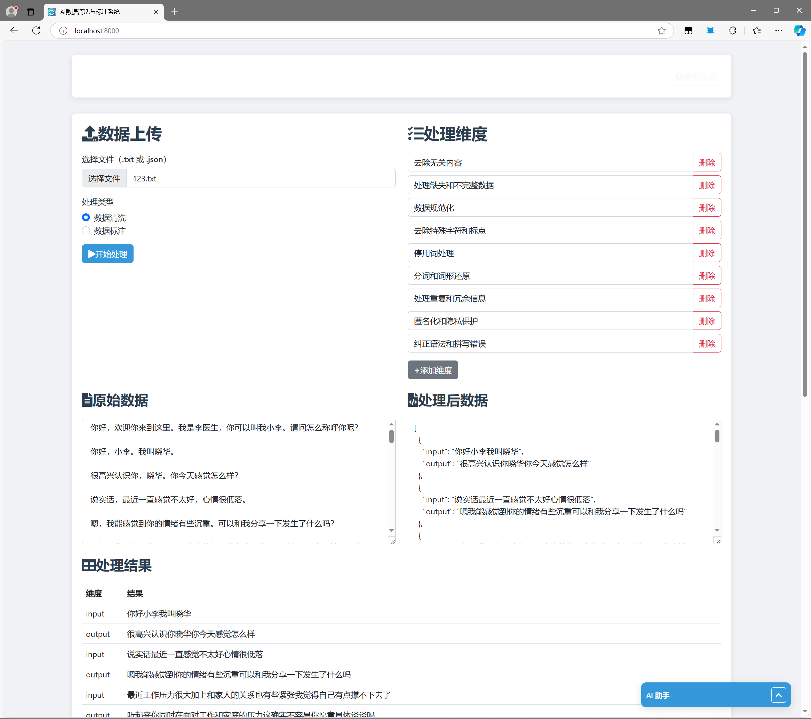

# AI 数据清洗与标注系统

一个基于 Django 的 AI 数据清洗与标注系统，专注于心理咨询对话数据的处理。

## 功能特点

- 多 AI 服务支持：OpenAI、智谱 AI、Deepseek
- AI聊天功能
- 数据处理功能：
  - 文本清洗
  - 对话标注
- 自定义功能：
  - 系统提示词配置
  - 清洗维度定制
  - 标注维度定制
- 后台管理功能：
  - API 配置管理
  - 对话记录查看
  - 系统提示词管理
## 快速开始

1. 克隆项目

bash
git clone https://github.com/fangguen/ai_cleaning_and_labeling_web-test.git
cd ai_cleaning_and_labeling_web-test

2. 创建虚拟环境

bash
pip install virtualenv
virtualenv .venv

3. 激活虚拟环境

bash
## Windows
.venv\Scripts\activate

## Linux/Mac
source .venv/bin/activate

4. 安装依赖

bash
pip install -r requirements.txt

5. 初始化数据库和创建管理员

bash
python manage.py migrate
python manage.py createsuperuser

6. 启动服务器

bash
python manage.py runserver

7. 访问系统
打开浏览器访问 http://127.0.0.1:8000/

## 使用说明

1. 首次使用需要配置 AI 服务的 API，以及最好能自行设置system的提示词并在提示词中给出范例，不然清洗和标注效果似乎不是很理想
2. 支持上传文本文件进行批量处理
3. 可以通过聊天界面进行实时对话
4. 支持自定义清洗和标注维度
5. 处理结果可以导出保存

## 项目说明

本人纯纯一名大一新生和 Python 初学者，想做这个玩意是因为我最近参加了个 AI 心理医生项目，有清洗和标注数据的需要还有就是最近对ai撸代码感兴趣。也就学了python基础和一点 Django 和前端框架知识，借助ai工具利用课余和课上时间开发。

### 开发过程

1. 使用 Claude 设计 Web 界面文案,使用o1生成django框架
2. 使用 Cursor 进行前端实现，后端代码完善，

### 项目效果

## 未来计划

1. 支持更多 AI 服务接口
2. 优化提示词系统
3. 更好渲染ai消息

## 项目收获

好玩...和累
